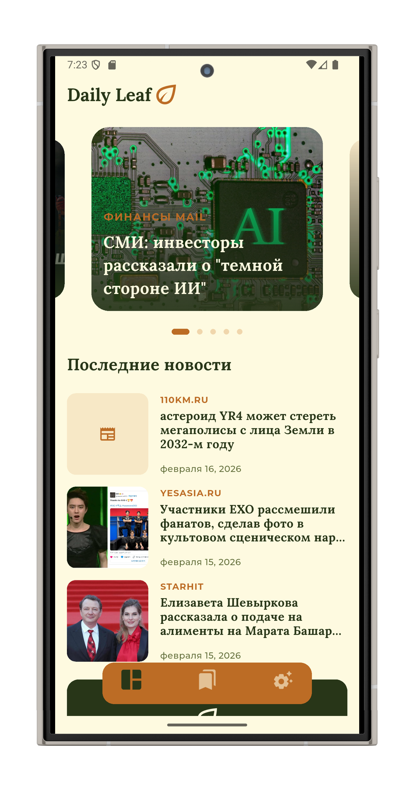
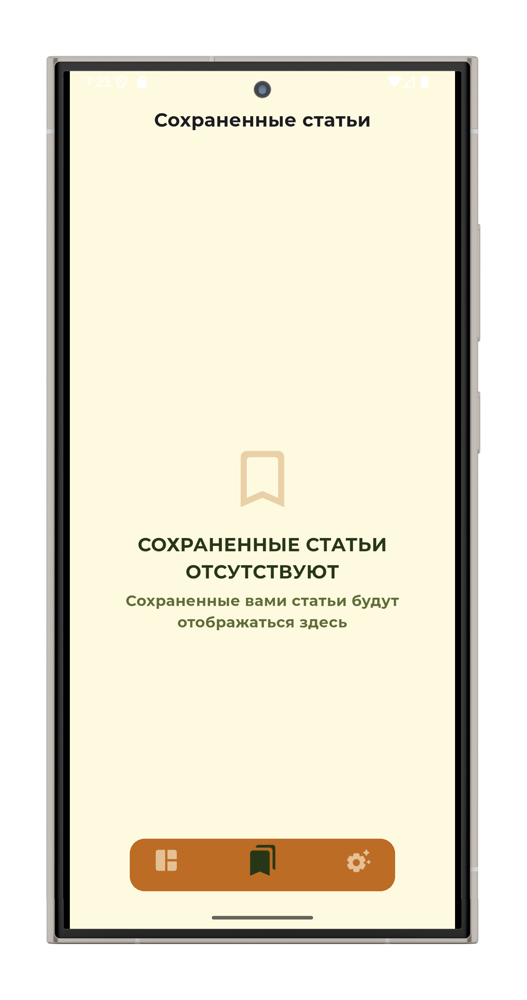
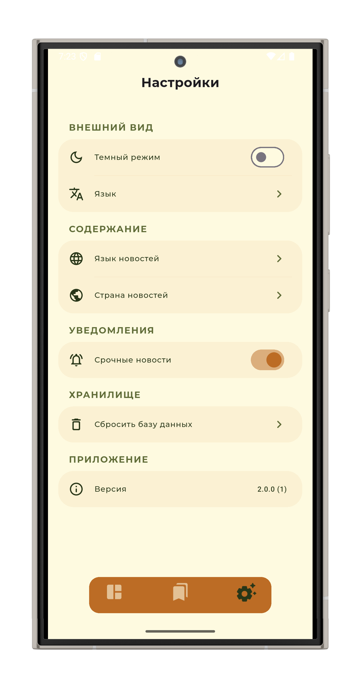
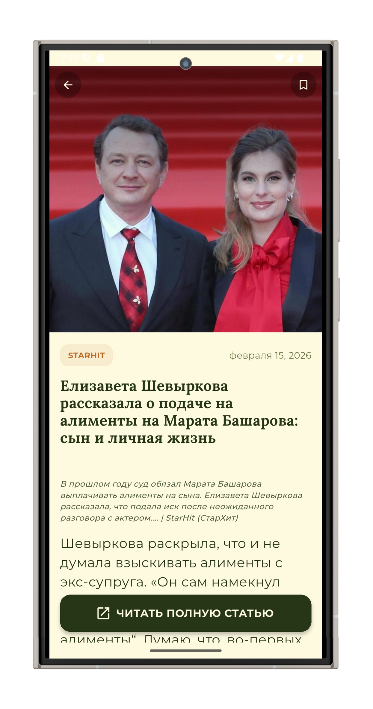
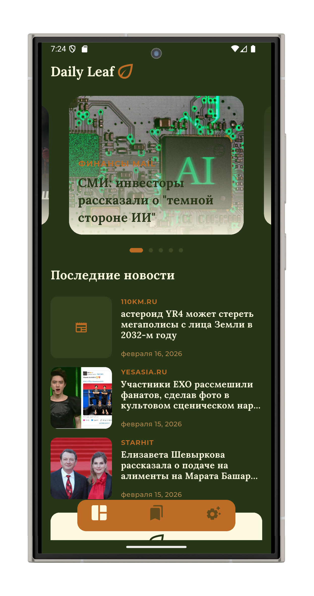
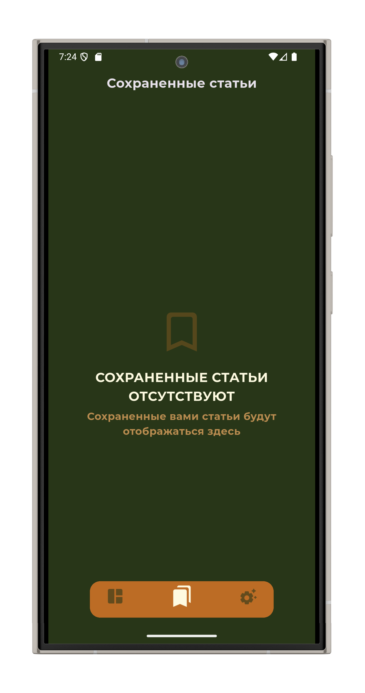
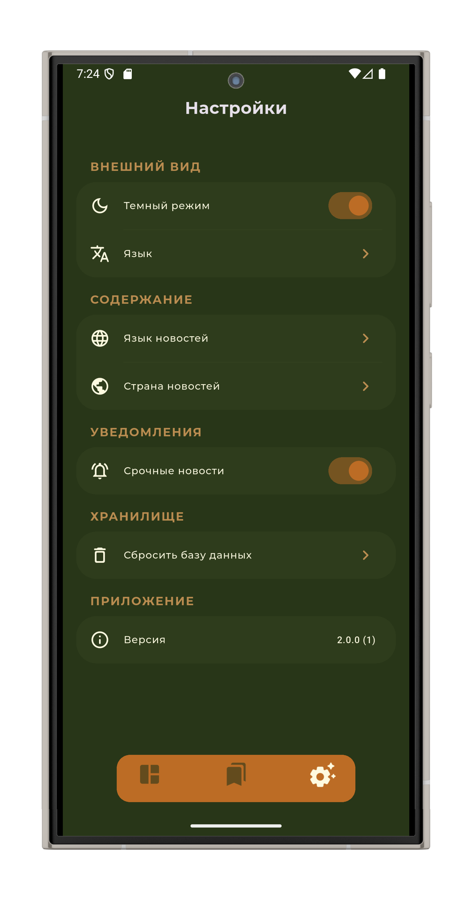

# 🌿 Daily Leaf - Modern News Aggregator

Daily Leaf is a sleek, minimalist news application built with Flutter, focused on clean architecture, real-time data fetching from GNews API.

## 📱 Preview
<h3 align="center" >Light Theme ☀️</h3>

  
  
  
  

<h3 align="center" >Dark Theme 🌙</h3>

  
  
  
  

## 🧠 About the Project

**Daily Leaf** allows users to stay informed with global news, filter content by country/language, and save important articles for offline reading.

This project was a complete **Rebirth (v2.0.0)** of an old 2022 concept, rebuilt in **Feb 2026** to demonstrate:
<ul>
  <li>Advanced <b>Feature-first (Clean Architecture)</b></li>
  <li>Robust local persistence with <b>Drift (SQLite)</b></li>
  <li>Secure environment management for API keys</li>
  <li>Deep localization (EN, RU, TR)</li>
  <li>Reactive state management</li>
</ul>

## 🚀 Features

<ul>
  <li>🌍 <b>Global Reach:</b> Real-time headlines from GNews API</li>
  <li>🔖 <b>Offline Bookmarks:</b> Save articles to local DB with Drift</li>
  <li>⚙️ <b>Dynamic Content:</b> Change news region & language on the fly</li>
  <li>🔔 <b>Alerts:</b> Local notifications for breaking news</li>
  <li>🌗 <b>Theming:</b> Seamless Light & Dark mode support</li>
  <li>⚡ <b>Performance:</b> Image caching and optimized network calls</li>
  <li>🔐 <b>Security:</b> API keys secured via .env variables</li>
</ul>

## 🛠 Tech Stack
<ul>
  <li><b>Flutter</b> - UI Framework</li>
  <li><b>Provider</b> - State Management</li>
  <li><b>Drift</b> - Reactive SQLite Database</li>
  <li><b>Dio</b> - Networking with Interceptors</li>
  <li><b>Flutter Dotenv</b> - Security</li>
  <li><b>Flutter Native Splash</b> - Branded startup experience</li>
</ul>

## 🏗 Architecture Principles
The project follows **Clean Architecture** principles within a **Feature-first** structure:

<ul>
  <li><b>Data Layer (core/):</b> Responsible for external data sources (GNews API, Drift DB). Includes <code>api_clients</code>, <code>database</code> schema, and <code>repositories</code> implementations.</li>
  <li><b>Domain Layer (core/models & interfaces):</b> Contains business entities and repository contracts. It is independent of UI and defines <i>what</i> the app does.</li>
  <li><b>Presentation Layer (features/):</b> Divided by feature (e.g., News, Settings). Each feature contains its own <code>pages</code>, <code>widgets</code>, and <code>providers</code> (State Management).</li>
</ul>

## 📁 Folder Structure
<pre><code>
lib/
 ├── src/
 │   ├── core/                  # Data & Business Logic Layer
 │   │   ├── api_clients/       # Network clients (Dio)
 │   │   ├── database/          # Local persistence (Drift/SQLite)
 │   │   ├── models/            # Data & domain entities
 │   │   ├── repositories/      # Data access layer
 │   │   │   ├── interfaces/    # Repository contracts (Abstraction)
 │   │   │   └── ...            # Repository implementations
 │   │   └── utils/             # Business helpers & extensions
 │   │
 │   ├── features/              # Presentation Layer (Feature-first)
 │   │   └── each_feature/      # (news, bookmarks, settings, etc.)
 │   │       ├── pages/         # UI Screens
 │   │       ├── providers/     # State management logic
 │   │       └── widgets/       # Feature-specific UI components
 │   │
 │   └── common/                # Shared Infrastructure
 │       ├── theme/             # Design system (Dark/Light)
 │       ├── shared_providers/  # App-wide state (Theme, Locale)
 │       ├── constants/         # Styles, Dimensions
 │       └── widgets/           # Global reusable UI components
 │
 └── main.dart                  # App bootstrap & Environment setup
</code></pre>

## 👨‍💻 About the Developer

Developed by Tash

Flutter Developer & Tech Enthusiast

💼 LinkedIn: <a href="https://linkedin.com/in/muhammed-taş-00a01619b/" target="_blank">click</a>

## ⚠️ Disclaimer
This application is for **portfolio and educational purposes**. News content is provided by the GNews API and belongs to their respective publishers.
